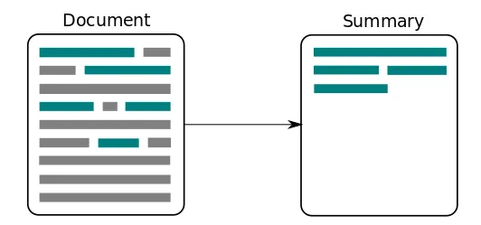

# Text-summarization

Text summarization is the process of shortening a set of data computationally, to create a subset that represents the most important or relevant information within the original content.



### Dependencies 

This project requires **Python 3.8** and the following Python libraries installed: Please utilize the environment file to install related packages.


Libraries : 
- [HuggingFace](https://huggingface.co/)
- [Transformers](https://huggingface.co/docs/transformers/installation)
- [Transformers sentencepiece](https://github.com/google/sentencepiece)
- [sacrebleu](https://github.com/mjpost/sacrebleu)
- [datasets](https://huggingface.co/docs/datasets/v1.15.1/tutorial.html)
- [evaluate](https://huggingface.co/docs/evaluate/index)
- [rouge_score](https://pypi.org/project/rouge-score/)

### Model 

[Model Documentation : Pegasus-cnn_dailymail](https://huggingface.co/google/pegasus-cnn_dailymail)

The Pegasus model was proposed in PEGASUS: [PEGASUS: Pre-training with Extracted Gap-sentences for Abstractive Summarization](https://arxiv.org/pdf/1912.08777.pdf) by Jingqing Zhang, Yao Zhao, Mohammad Saleh and Peter J. Liu on Dec 18, 2019.

(-) PEGASUS proposes a transformer-based model for abstractive summarization. It uses a special self-supervised pre-training objective called gap-sentences generation (GSG) that's designed to perform well on summarization-related downstream tasks.

(-) Pegasus achieves SOTA summarization performance on all 12 downstream tasks, as measured by ROUGE and human eval.

### Dataset 

[Dataset Documentation : samsum Dataset](https://huggingface.co/datasets/samsum)

The SAMSum dataset contains about 16k messenger-like conversations with summaries. Conversations were created and written down by linguists fluent in English. Linguists were asked to create conversations similar to those they write on a daily basis, reflecting the proportion of topics of their real-life messenger conversations. 
 
### Folder Structure 
```
├──  artifacts    - folder where data artifacts are stored 
│    └── data_ingestion - contains the downloaded data files.   
|    └── data_validation - contains the validation status file.
|    └── data_transformation - contains the dataset after transformation.
│    └── model_training - contains the trained model and tokenizer.
|    └── model_evaluation - contains results of model evaluation as a CSV file.    
|
├── config    - contains config YAML file which specifies Paths of required artifacts
├── images    - contains images used in this repository.
│                 
├── research
│    └── Text_Summarizer_Pegasus.ipynb - research notebooks to Train, evaluate and test Text Summarizer Pegasus model. 
|    └── 01_data_ingestion.ipynb - pre-pipeline implementation notebook for data ingestion 
|    └── 02_data_validation.ipynb - pre-pipeline implementation notebook for data validation 
|    └── 03_data_transformation.ipynb - pre-pipeline implementation notebook for data transformation 
|    └── 04_model_trainer.ipynb - pre-pipeline implementation notebook for model training 
|    └── 05_model_trainer.ipynb - pre-pipeline implementation notebook for model evaluation
|
├── src/textSummarizer
|          └── components
|                └── data_ingestion.py
|                └── data_transformation.py
|                └── data_validation.py
|                └── model_trainer.py
|          └── config
|               └── __init__.py
|                └── configuration.py 
|          └── constants
|                └── __init__.py
|          └── entity
|                └── __init__.py
|          └── logging
|                └── __init__.py
|          └── pipeline
|                └── stage_01_data_ingestion.py
|                └── stage_02_data_validation.py
|                └── stage_03_data_transformation.py
|                └── stage_04_model_training.py
|                └── stage_05_model_evaluation.py
|          └── utils
|                └── common.py
                      